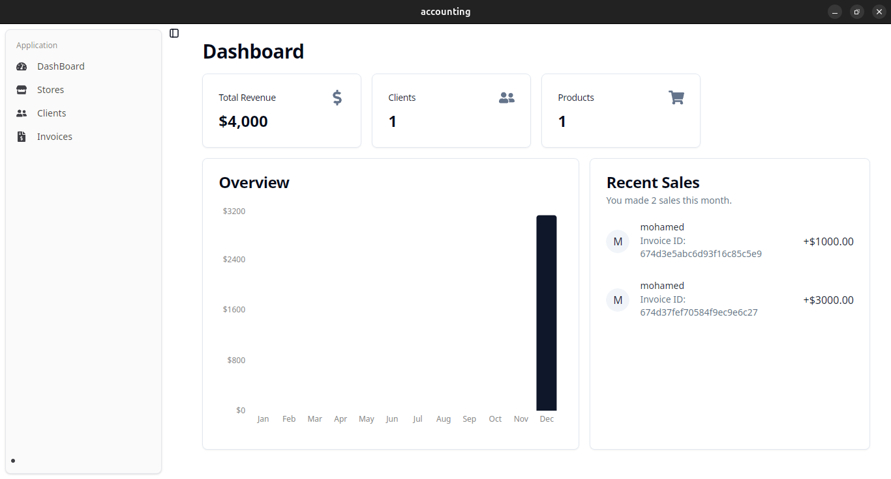

# Accounting App

This is a desktop application built with **Tauri** and **React** that allows users to manage clients, products, and invoices. It provides an easy way to track clients, add products, and generate invoices. The app is intended for small businesses and freelancers who need to keep track of their sales and clients.

## Technologies

- **Tauri**: Desktop app framework.
- **React**: Frontend framework.
- **MongoDB**: Database for managing data.
- **Vite**: Fast development server.

## Preview



## Features

- **Client Management**:
  - Add, edit, and view client information, such as contact details and address.
- **Product Management**:
  - Manage product inventory with pricing, SKU numbers, and descriptions.
- **Invoice Generation**:
  - Create professional invoices with auto-calculated totals and discounts.
  - Save invoices as drafts or mark them as paid.
- **Overview Dashboard**:
  - Real-time insights into your business with revenue trends, client activity, and sales summaries.
- **Recent Sales**:
  - View the latest transactions, including amounts, clients, and statuses.

## Usage

1. Add a new client by navigating to the "Clients" tab.
2. Create a product in the "Products" section.
3. Generate an invoice by selecting the client and products, then click "Create Invoice."

## Installation

### Prerequisites

- Follow the [installation guide](https://v2.tauri.app/start/prerequisites/) for more detailed instructions.

### Steps to Install

1. **Clone the repository:**

   ```bash
   git clone https://github.com/mohamed-abd-elkahlk/accounting

   cd accounting 
   ```

2. **Install dependencies and Start the Development App:**

    ```bash
    pnpm install
    pnpm tauri dev
    ```

   - Or, use your favorite package manager to install the app.

3. **Add `.env` File:**
   - Create a `.env` file in the *`src-tauri`* directory of the project.
   - Add the following environment variables:

     ```bash
     DATABASE_STRING=""
     DATABASE_NAME="Example"
     ```

   - Replace the placeholder values with your actual database connection string and name.
4. **Build the App:**
   - To create a production-ready build of the app, run the following command:

     ```bash
     pnpm tauri build
     ```

   - The built application will be located in the `src-tauri/target/release/` directory.

## Getting Started

To start using the Accounting App:

1. Clone the repository: `git clone https://github.com/mohamed-abd-elkahlk/accounting`
2. Install dependencies: `pnpm install`
3. Start the development server: `pnpm tauri dev`

## Contributing

Contributions are welcome! To contribute:

1. Fork the repository.
2. Create a new branch: `git checkout -b feature-name`.
3. Commit your changes: `git commit -m "Add feature-name"`.
4. Push to the branch: `git push origin feature-name`.
5. Create a pull request.


## FAQ

**Q: How do I connect to my database?**  
A: Add your database connection string to the `.env` file under `DATABASE_STRING`.

**Q: What if the app doesn't start after installation?**  
A: Ensure all prerequisites are installed, especially Rust and Node.js.

## License

This project is licensed under the MIT License. See the [LICENSE](LICENSE) file for details.
